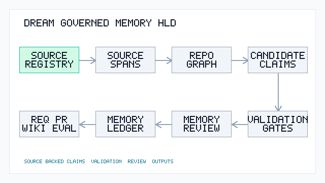

<!-- SPDX-License-Identifier: Apache-2.0 -->

# DREAM - Domain-aware Requirements, Engineering Automation & Memory

DREAM is an open-source, source-backed memory platform for teams that need their
AI workflows to stay grounded in real organizational context.



It turns scattered knowledge such as docs, runbooks, code structure, incidents,
historical tickets, PR notes, test plans, and review rules into reusable memory
that workflow assistants can retrieve, cite, evaluate, and audit.

The first packaged use case is software engineering: DREAM helps teams turn
incomplete business requests into evidence-backed engineering briefs, impact
maps, clarification questions, Jira-ready drafts, PR review summaries, and
quality scorecards. The platform layer is intentionally general so other
domain-specific memory workflows can be added without becoming a generic
chatbot.

This repository uses synthetic DemoCorp examples only. For enterprise use, keep
company-specific knowledge packs, connectors, prompts, and deployment configs in
private repositories.

## Open-Core / Private Extension Pattern

DREAM public core contains the generic framework, synthetic DemoCorp data,
provider interfaces, and local/mock providers. Private extension repositories
contain private knowledge packs, private LLM providers, private prompt and
redaction policies, deployment configs, connectors, and generated artifacts.

Public core can be imported into a private environment, but private extensions
should not be pushed back to public core. When a private implementation reveals
a generic improvement, recreate it with synthetic examples before upstreaming.

## Why DREAM Exists

Teams rarely lack information. They lack a reliable way to make the right
information show up at the moment a decision is made.

DREAM treats team context as memory, not prompt decoration. It connects durable
knowledge packs, codebase indexes, historical examples, and audit/evaluation
records to repeatable workflows. In the demo engineering domain, this reduces
knowledge asymmetry across BA, TL, frontend, backend, QA, and operations roles.
In other domains, the same pattern can support any workflow that needs grounded
context, traceable sources, and human review.

## General Memory Platform

DREAM is built around a reusable memory model:

- Memory packs: Markdown/YAML collections for domain docs, runbooks, incidents,
  historical cases, review rules, and operating guidance.
- Memory indexes: structured indexes over codebases or other local artifact
  folders, including files, symbols, concepts, tests, and relationships.
- Memory retrieval: deterministic keyword and metadata search today, with a
  clean path to vector retrieval later.
- Memory workflows: assistants that transform rough inputs into structured,
  source-backed outputs.
- Memory distillation: governed extraction of code/doc facts into cited,
  reviewable memory claims.
- Memory governance: audit logs, scorecards, human ratings, warnings, and
  generated artifacts saved for review.

The repository ships with engineering workflows because they are concrete and
easy to demo. The core idea is broader: DREAM is a framework for building
domain-aware memory applications.

## What DREAM Does

- Loads team memory packs from Markdown and `team.yaml`.
- Builds lightweight memory indexes for local repositories and artifact folders.
- Builds Evidence Graph Lite paths across concepts, docs, code, tests, incidents, Jira, and PR memory.
- Distills repositories and knowledge packs into source-backed memory claims
  with citation, secrecy, and human-review guardrails.
- Extracts files, languages, classes, methods, endpoints, test mappings, concepts, and summaries.
- Performs deterministic keyword retrieval without a vector database.
- Generates source-backed requirement drafts.
- Creates Requirement Cases with impact maps, role-specific clarification questions, engineering briefs, and Jira-ready drafts.
- Generates AI PR review summaries from a local diff and optional fake Jira-style context.
- Enhances PR review summaries with codebase memory when an index exists.
- Evaluates generated artifacts with deterministic, source-backed scorecards.
- Records generation runs in SQLite.
- Stores human ratings for generated outputs.
- Exposes a FastAPI API and Typer CLI.
- Includes an Angular mock-data workbench for the main MVP workflows.
- Provides a `TestGenProvider` interface plus mock and JTestGen stub providers.

## What DREAM Does Not Do

DREAM does not include a production test-generation engine. It provides a
`TestGenProvider` interface so tools such as JTestGen can be connected later.

The MVP also does not include real GitHub integration, real Jira integration, PR
posting, vector search, code graph precision, model fine-tuning, generic chat,
or enterprise security features.

The Angular frontend does not implement a unit-test generation engine. Its
TestGen page is a safe mock/stub workflow that plans and reports without
generating tests, running external tools, or modifying repositories.

## Quickstart

```bash
python -m venv .venv
source .venv/bin/activate
pip install -e ".[dev]"
pytest
ruff check .
```

On Windows PowerShell:

```powershell
python -m venv .venv
.\.venv\Scripts\Activate.ps1
pip install -e ".[dev]"
pytest
ruff check .
```

## Qwen Cloud Hackathon Mode

DREAM is now packaged for the Global AI Hackathon Series with Qwen Cloud as a
Track 1 MemoryAgent submission. The hackathon build keeps DREAM's source-backed
memory core, governed memory distillation, audit ledger, context trail, and
human review flow, then swaps live generation to Qwen Cloud through the
OpenAI-compatible API.

Run a live Qwen Cloud smoke test:

```powershell
$env:DREAM_CONFIG_FILE="examples/config/dream.qwen.yaml"
$env:DASHSCOPE_API_KEY="<your-qwen-cloud-api-key>"
$env:QWEN_BASE_URL="https://dashscope-intl.aliyuncs.com/compatible-mode/v1"
dream llm smoke --provider qwen-cloud --prompt "Return DREAM_QWEN_OK and one sentence about persistent engineering memory."
```

Run the API in Qwen mode:

```powershell
$env:DREAM_CONFIG_FILE="examples/config/dream.qwen.yaml"
$env:DASHSCOPE_API_KEY="<your-qwen-cloud-api-key>"
$env:QWEN_BASE_URL="https://dashscope-intl.aliyuncs.com/compatible-mode/v1"
uvicorn dream.api.app:app --reload --host 127.0.0.1 --port 8000
curl http://localhost:8000/health
scripts/qwencloud-hackathon-verify.ps1 -BaseUrl http://localhost:8000
scripts/qwencloud-hackathon-proof.ps1 -BaseUrl http://localhost:8000
scripts/qwencloud-hackathon-submit-gate.ps1 -BaseUrl http://localhost:8000
scripts/qwencloud-hackathon-audit.ps1 -BaseUrl http://localhost:8000
```

Key submission artifacts:

- [Qwen Cloud submission brief](docs/qwencloud-submission.md)
- [Qwen Cloud architecture](docs/qwencloud-architecture.md)
- [Qwen Cloud demo video script](docs/qwencloud-demo-video-script.md)
- [Qwen Cloud submission kit](docs/qwencloud-devpost-submission-kit.md)
- [Qwen Cloud contest launch checklist](docs/qwencloud-live-checklist.md)
- [Qwen Cloud final 5-minute checklist](docs/qwencloud-final-5min-checklist.md)
- [Qwen Cloud Devpost form fields](docs/qwencloud-devpost-form-fields.md)
- [Qwen Cloud publish playbook](docs/qwencloud-publish-playbook.md)
- [Qwen Cloud gap list](docs/qwencloud-gap-list.md)
- [Alibaba Cloud deployment proof](deploy/alibaba/README.md)
- [Architecture diagram asset](docs/assets/qwencloud-architecture.svg)

## Angular Frontend

The frontend lives in `frontend/` and uses Angular 19 standalone components,
routing, SCSS design tokens, typed reactive forms, and live FastAPI data. It is
designed as a large-enterprise finance engineering workbench: deep navy
navigation, white and pale blue-gray work surfaces, teal/cyan action accents,
dense tables, clear review gates, and restrained motion. It does not copy
third-party logos, trademarks, imagery, or brand assets.

Run it locally:

```powershell
uvicorn dream.api.app:app --reload --host 127.0.0.1 --port 8000
```

```powershell
cd frontend
npm install
npm run build
npm test -- --watch=false --browsers=ChromeHeadless
npm start -- --host 127.0.0.1 --port 4300
```

Open `http://localhost:4300/`.

If local development ports are already occupied, build and serve the static
bundle from `frontend/dist/frontend/browser` on any free local port.

Current live workflows included:

- Mission Control work queue backed by FastAPI intake, requirement, audit, eval,
  and codebase records.
- Memory Hub source intake lifecycle: browser file upload or backend path
  registration, parse, edit draft metadata, approve, promote, and view promoted
  structured Markdown. `/memory/:documentId` opens a source detail page with raw
  source preview, parsed sections, source spans, section hashes, normalized
  Markdown, review state, promoted path, intake audit events, and downstream
  workflow runs that later consumed the promoted source. Downstream usage shows
  matched source paths, a match reason, structured match proofs with source hash
  and section span/hash evidence, and an Audit route when available.
  Draft metadata updates, review decisions, and promotion actions also write
  structured review events with field diffs, metadata snapshots, source hash,
  section hashes, reviewer notes, and linked audit run ids.
  Intake records include source hashes and duplicate-content warnings for
  provenance.
- Memory distillation scans turn promoted intake docs into governed
  `MemoryClaim` candidates whose evidence includes `intake_proofs`: raw intake
  document id, draft id, promoted path, source hash verification, intake audit
  run ids, section-level span/hash proof, deterministic match explanation, and
  matched terms.
- Memory Hub includes a Claim Review tab backed by `/memory/diff`,
  `/memory/conflicts`, `/memory/review`, and `/memory/ledger`. Reviewers can run
  a memory scan, inspect latest-scan claim evidence and intake proof, compare
  active single-value conflict pairs with raw source links, then approve, reject,
  or quarantine claims into the durable ledger. Review proof now includes
  reviewer signature, field-level governance diffs, a claim snapshot, and
  risk/conflict signals with reviewer-readable explanations and evidence. Diff
  state marks added/changed claims without hiding unchanged candidates that still
  need review.
- Codebase Index repo browser backed by saved JSON index artifacts and file
  content endpoints.
- Requirement Case workflow with impact map, open questions, Jira proposal,
  source-detail links for matched intake docs, and strict Eval Agent result.
- PR Review workflow with inline diff/Jira context, codebase memory, source-detail
  links for matched intake docs, review output, and strict Eval Agent result.
- Audit & Eval with scorecards, case-by-case detail, audit runs, and
  FastAPI-backed human ratings persisted in SQLite. Audit run source chips link
  back to `/memory/:documentId` when a retrieved source matches a registered
  intake document.
- Context Trail detail at `/context/:caseId`, backed by FastAPI context trail,
  context pack, and prompt-preview APIs. Selected evidence rows show retrieval
  reasons and link back to `/memory/:documentId` for matched intake documents.
  Memory claim references carry `intake_proofs` through the context APIs, so
  approved claim usage remains traceable to raw intake documents, section proof,
  and deterministic claim/source match explanations.

Primary routes are `/mission-control`, `/memory`, `/memory/:documentId`,
`/workbench`, `/requirements`, `/review`, `/context/:caseId`, `/codebase`,
`/audit`, and `/audit/:targetId`. Legacy mock routes redirect to these primary
surfaces.

Requirement Case and PR Review use FastAPI. OpenAI-compatible generation is
opt-in from the backend process; API keys stay in backend environment variables.

## Current Planning and Handoff Docs

For the latest UI simplification pass and product planning context, start here:

- `docs/recent-changes-planning-handoff.zh-CN.md` - Chinese handoff for the
  current branch, recent UI changes, product decisions, and the raw doc to
  structured memory lifecycle.
- `docs/current-development-handoff.md` - short engineering handoff for runtime,
  branch state, routes, known limits, and verification commands.
- `docs/knowledge-intake-pipeline.md` - source intake architecture and current
  implementation details.
- `docs/codebase-memory.md` - repo browser, saved JSON index, and codebase
  memory behavior.
- `docs/evaluation-agent.md` - Eval Agent scorecards, dimensions, API, and
  frontend detail flow.

## CLI Examples

```bash
dream kb list-teams
dream kb search --team demo_team --query "job execution"
dream codebase index --team demo_team --repo examples/java-demo-repo --name java-demo-repo
dream codebase search --team demo_team --repo java-demo-repo --query "async status tracking"
dream graph build --team demo_team --repo java-demo-repo
dream graph search --team demo_team --repo java-demo-repo --query "execution status"
dream graph explain --team demo_team --repo java-demo-repo --concept "execution status"
dream memory scan --team demo_team --repo examples/java-demo-repo --name java-demo-repo
dream memory diff --team demo_team
dream memory review --team demo_team --claim <claim_id> --status approved --reviewer zack
dream memory search --team demo_team --query "execution status"
dream memory context --team demo_team --query "execution status"
dream memory eval --team demo_team
dream req create --team demo_team --request "Add async status tracking for long-running job execution" --role BA
dream req analyze --case <case_id>
dream req impact --case <case_id>
dream req questions --case <case_id> --role TL
dream req brief --case <case_id>
dream req jira --case <case_id>
dream requirement draft --team demo_team --request "Add async status tracking"
dream review pr --team demo_team --repo java-demo-repo --diff examples/fake_pr_diff.diff --jira examples/fake_jira_ticket.md
dream testgen plan --team demo_team --repo examples/java-demo-repo
dream testgen run --provider mock --team demo_team --repo examples/java-demo-repo --dry-run
dream audit list
dream eval run --target-type engineering_brief --artifact examples/outputs/engineering-brief-async-status-example.md --team demo_team --profile async-status-tracking
```

Use OpenAI-compatible generation explicitly when `OPENAI_API_KEY` or
`OPENAI_COMPATIBLE_API_KEY` is configured:

```bash
dream requirement draft \
  --team demo_team \
  --request "Users want to know which task is still running when a forecast job takes too long" \
  --llm-provider openai-compatible

dream review pr \
  --team demo_team \
  --repo dfp-demo-repo \
  --diff examples/pr-diffs/DFP-110-output-collector-idempotency.diff \
  --jira knowledge_packs/demo_team/docs/historical-jira/DFP-110-output-collection-idempotency.md \
  --llm-provider openai-compatible

dream req brief --case <case_id> --llm-provider openai-compatible
dream req jira --case <case_id> --llm-provider openai-compatible
```

OpenAI-compatible generation is opt-in. Local tests and demos use the mock
provider or deterministic generators by default.

Rate a generated run:

```bash
dream eval rate <run_id> --usefulness 4 --correctness 4 --comments "Good first draft"
```

## API Examples

Start the API:

```bash
uvicorn dream.api.app:app --reload
```

Health check:

```bash
curl http://localhost:8000/health
```

Requirement draft:

```bash
curl -X POST http://localhost:8000/requirements/draft \
  -H "Content-Type: application/json" \
  -d '{"team_id":"demo_team","rough_business_request":"Add async status tracking for long-running job execution"}'
```

Codebase index:

```bash
curl -X POST http://localhost:8000/codebase/index \
  -H "Content-Type: application/json" \
  -d '{"team_id":"demo_team","repo_path":"examples/java-demo-repo","repo_name":"java-demo-repo"}'
```

Evidence graph:

```bash
curl -X POST http://localhost:8000/graph/build \
  -H "Content-Type: application/json" \
  -d '{"team_id":"demo_team","repo_name":"java-demo-repo"}'

curl "http://localhost:8000/graph/search?team_id=demo_team&repo_name=java-demo-repo&query=execution%20status"
```

Knowledge intake:

```bash
curl -X POST http://localhost:8000/intake/documents \
  -H "Content-Type: application/json" \
  -d '{"team_id":"demo_team","file_path":"examples/intake-samples/runbook-output-reconciliation.md","document_type":"runbooks"}'

curl -X POST "http://localhost:8000/intake/documents/<document_id>/parse"

curl "http://localhost:8000/intake/drafts/<draft_id>/review-events"

curl "http://localhost:8000/intake/documents/<document_id>/detail"
```

Governed memory distillation:

```bash
curl -X POST http://localhost:8000/memory/scan \
  -H "Content-Type: application/json" \
  -d '{"team_id":"demo_team","repo_path":"examples/java-demo-repo","repo_name":"java-demo-repo"}'

curl "http://localhost:8000/memory/diff?team_id=demo_team"

curl "http://localhost:8000/memory/conflicts?team_id=demo_team"

curl -X POST http://localhost:8000/memory/conflicts/resolve \
  -H "Content-Type: application/json" \
  -d '{"team_id":"demo_team","conflict_id":"<conflict_id>","winning_claim_id":"<claim_id>","reviewer":"zack","reason":"Source A is authoritative."}'

curl "http://localhost:8000/memory/conflict-resolutions?team_id=demo_team"

curl -X POST http://localhost:8000/memory/review \
  -H "Content-Type: application/json" \
  -d '{"team_id":"demo_team","claim_id":"<claim_id>","status":"approved","reviewer":"zack"}'

curl "http://localhost:8000/memory/search?team_id=demo_team&query=execution%20status"

curl "http://localhost:8000/memory/context-card?team_id=demo_team&query=execution%20status"

curl -X POST http://localhost:8000/memory/eval \
  -H "Content-Type: application/json" \
  -d '{"team_id":"demo_team","scan_id":"latest"}'

curl -X POST http://localhost:8000/audit/runs/<run_id>/ratings \
  -H "Content-Type: application/json" \
  -d '{"usefulness_score":4,"correctness_score":4,"comments":"Good first draft"}'

curl "http://localhost:8000/audit/runs/<run_id>/ratings"
```

Requirement Case:

```bash
curl -X POST http://localhost:8000/requirement-cases \
  -H "Content-Type: application/json" \
  -d '{"team_id":"demo_team","raw_request":"Add async status tracking for long-running job execution","created_by_role":"BA"}'
```

PR review summary:

```bash
curl -X POST http://localhost:8000/review/pr \
  -H "Content-Type: application/json" \
  -d '{"team_id":"demo_team","repo_name":"java-demo-repo","pr_diff_path":"examples/fake_pr_diff.diff","jira_context_path":"examples/fake_jira_ticket.md"}'
```

Mock test generation:

```bash
curl -X POST http://localhost:8000/testgen/run \
  -H "Content-Type: application/json" \
  -d '{"provider":"mock","team_id":"demo_team","repo_path":"examples/java-demo-repo","target_language":"java","dry_run":true}'
```

Evaluation scorecard:

```bash
curl -X POST http://localhost:8000/eval/run \
  -H "Content-Type: application/json" \
  -d '{"target_type":"engineering_brief","artifact_path":"examples/outputs/engineering-brief-async-status-example.md","team_id":"demo_team","expected_profile":"async-status-tracking"}'
```

## Knowledge Pack Structure

```text
knowledge_packs/demo_team/
  team.yaml
  docs/
    domain/
    architecture/
    runbooks/
    testing/
    pr-review/
```

`team.yaml` declares the team id, applications, repositories, document paths,
review rules, requirement template, and test-generation settings. Markdown files
can include YAML front matter for `app`, `component`, and `doc_type`.

## TestGen Plugin Model

The MVP includes:

- `TestGenProvider` interface
- `MockTestGenProvider`
- `JTestGenAdapter` safe stub

The mock provider does not modify repositories, run Maven, or create files in
the target repo. It writes a fake report under `artifacts/` and always requires
human review.

## Codebase Memory

Codebase memory is stored as JSON artifacts under
`artifacts/codebase-indexes/{team_id}/{repo_name}.json`. It records repo files,
language, file role, symbols, simple dependencies, concept mappings, source-to-test
mappings, summaries, and warnings. It is intentionally deterministic and does not
require a vector database.

## Evidence Graph

Evidence Graph Lite is stored under
`artifacts/evidence-graphs/{team_id}/{repo_name}.json`. It links concept nodes
to knowledge docs, code files, symbols, tests, incidents, historical Jira, and
historical PRs using deterministic edges such as `IMPLEMENTED_BY`, `TESTED_BY`,
`REGRESSED_BY`, `REQUIRED_BY`, and `CHANGED_BY`.

Requirement Case analysis and PR Review use the graph when it exists. The user
workflow stays simple; graph expansion happens underneath retrieval so outputs
can show evidence paths instead of ungrounded claims.

## Governed Memory Distillation

Memory distillation converts local repository structure and team knowledge-pack
documents into `MemoryClaim` records. Deterministic code claims can be approved
automatically; semantic document claims remain candidates until human review.

Each claim carries source spans, extraction metadata, governance status,
security classification, and audit timestamps. Scans also persist repo
provenance including schema version, commit SHA, dirty state, and scanner
version. Source hashes stay based on original content, while persisted previews
are redacted for secret-like assignments and common token patterns.

MVP validation checks citation validity, unsupported claims, secret-like
leakage, and accidental semantic auto-promotion before memory is treated as
durable.

The governed review loop adds a durable approval ledger under
`artifacts/memory-ledgers/{team_id}.json`. Review events can approve, reject,
quarantine, or return claims to candidate status. Each event records the
reviewer, reason, timestamp, reviewer signature, field-level governance diffs,
claim snapshot, raw risk/conflict signals, and reviewer-readable signal
explanations. Approved claims are available through `dream memory search` and
`dream memory context`; candidate claims remain review-only. The same loop is
exposed in the Memory Hub Claim Review tab, where recent decisions show
structured inline proof with decision metadata, field diffs, claim snapshot,
explained signals, and raw-trace links.

`/memory/conflicts` returns active single-value claim pairs that share an
entity/relation but disagree on value. Each pair includes both claims, effective
review status, latest review event when present, evidence paths, intake document
ids, and a conflict explanation so raw sources can be compared before a claim is
treated as durable memory. `/memory/conflicts/resolve` currently supports the
conservative `approve_winner_reject_other` action: it approves the selected
claim, rejects the other side through the normal review ledger, and writes a
dedicated conflict resolution event under
`artifacts/memory-conflict-resolutions/{team_id}.json`.

`dream memory diff` compares the latest scan with the previous scan when one is
available, showing added, removed, changed, and unchanged claim counts. Without
a base scan it falls back to a full review queue.

See [Memory Distillation](docs/memory-distillation.md) for the design, CLI/API
workflow, and acceptance guardrails.

Raw doc to structured memory acceptance can be run without mutating local
artifacts:

```bash
python scripts/verify_raw_doc_memory_flow.py
```

## Requirement Case

A Requirement Case starts from a rough request and produces:

- Intent summary
- Retrieved context from knowledge docs and codebase memory
- Impact map
- Role-specific clarification questions
- Engineering brief
- Jira-ready draft
- Audit trail

See [DREAM Demo HLD](docs/demo-hld.md) for the recommended demo script,
high-level architecture, and product talk track.

## Evaluation Agent

DREAM includes a deterministic Evaluation Agent for generated engineering
outputs. It scores completeness, evidence quality, impact accuracy, role
coverage, test awareness, historical context, actionability, specificity, and
hallucination risk. PR reviews and TestGen reports use specialized dimensions.

Scorecards are written under `artifacts/evals/` and stored in SQLite. DemoCorp
golden profiles live under `knowledge_packs/demo_team/eval_profiles/` and define
expected concepts, code, tests, docs, incidents, Jira, PRs, roles, and critical
risks for common DFP scenarios.

The evaluator is local and rule-based by default. It does not require OpenAI or
any paid API.


## Demo Dataset: DemoCorp Forecast Platform

DFP is a synthetic enterprise forecast and analytics platform for DREAM demos. It includes UI, Java backend, AWS-style orchestration, and Python processor layers. It also includes architecture docs, runbooks, incident history, Jira history, PR history, testing docs, concept memory, fake code, fake diffs, rough requirement requests, and representative outputs.

The dataset is designed to demonstrate codebase-aware engineering memory across requirement intelligence, impact mapping, PR review, audit/eval, and codebase indexing. All data is synthetic and uses DemoCorp / DFP / ForecastDemo / BatchJobDemo naming only.

Recommended demo flow:

```bash
dream kb search --team demo_team --query "execution status stuck running"

dream codebase index \
  --team demo_team \
  --repo examples/dfp-demo-repo \
  --name dfp-demo-repo

dream codebase search \
  --team demo_team \
  --repo dfp-demo-repo \
  --query "status tracker batch task"

dream graph build \
  --team demo_team \
  --repo dfp-demo-repo

dream graph explain \
  --team demo_team \
  --repo dfp-demo-repo \
  --concept "execution status"

dream req create \
  --team demo_team \
  --request "Users want to know which task is still running when a forecast job takes too long" \
  --role BA

dream req analyze --case <case_id>
dream req impact --case <case_id>
dream req questions --case <case_id> --role TL
dream req brief --case <case_id>
dream req jira --case <case_id>

dream review pr \
  --team demo_team \
  --repo dfp-demo-repo \
  --diff examples/pr-diffs/DFP-110-output-collector-idempotency.diff \
  --jira knowledge_packs/demo_team/docs/historical-jira/DFP-110-output-collection-idempotency.md

dream eval run \
  --target-type pr_review \
  --artifact examples/outputs/pr-review-output-collector-example.md \
  --team demo_team \
  --profile output-collection-idempotency
```

## Docker

```bash
docker compose up --build
```

The API runs on port 8000. Check `http://localhost:8000/health`.

## License

DREAM is licensed under the Apache License, Version 2.0. See [LICENSE](LICENSE).

## Legal and Provenance

- [NOTICE](NOTICE) records project attribution and the synthetic-data boundary.
- [PROVENANCE](PROVENANCE.md) documents the public upstream boundary and company
  import policy.
- [CONTRIBUTING](CONTRIBUTING.md) describes clean contribution rules, DCO
  sign-off, and employer-code restrictions.
- [THIRD_PARTY_NOTICES](THIRD_PARTY_NOTICES.md) summarizes current third-party
  dependency license posture.
- [SECURITY](SECURITY.md) documents vulnerability reporting and sensitive-data
  boundaries.

## Roadmap

- Vector retrieval
- Deeper code graph relationships beyond Evidence Graph Lite
- GitHub and Jira connectors
- Historical PR/Jira ingestion
- Workflow integration for approved memory context cards
- JTestGen integration
- UI workspace and role-specific dashboards
- Angular frontend API integration
- Mock-to-real service adapter layer
- Team-level and organization-wide configuration
- Evaluation Agent metrics, score trends, and quality gates
