# DREAM Frontend Runbook

> 历史版本：本 runbook 生成于当前 live FastAPI UI 简化之前，保留作参考。
> 新一轮产品验收前必须重新截图并生成。当前路由和运行方式见
> `docs/frontend-angular.md` 与 `docs/current-development-handoff.md`。

生成时间：`2026-07-01T12:49:58.521Z`

目标环境：`http://127.0.0.1:4300`

截图方式：`Chrome DevTools Protocol viewport-height screenshot`

本 runbook 覆盖 Angular router 中的全部实际页面路由；`/` 和 `/dashboard` 会重定向到 `/mission-control`，`**` 也会回到 `/mission-control`，所以不单独截图。

安全边界：
- 当前 UI 以 mock/demo 数据为主，不包含真实公司数据、真实 Jira、真实 PR、真实日志或真实 repo 写入。
- Requirement Case 和 PR Review 默认使用 `Mock local provider`；只有切到 `Real FastAPI + OpenAI-compatible provider` 时才会调用后端 `127.0.0.1:8000`。
- PR Review 的 real mode 当前发送后端固定的 synthetic diff/Jira 路径，不是把页面 textarea 里的 diff/Jira 原文直接传给后端。
- Knowledge Intake、Eval Rating、TestGen Stub 的状态是前端 in-memory/demo 行为，不等于生产落库。
- Knowledge Intake 上传使用浏览器本地 `file.text()` 做 demo parse；不要把它当成可靠 DOCX/HTML/JSON 解析器，也不要上传真实敏感资料。
- TestGen Stub 不生成单元测试，也不写 repository。

## 开发者总览

- 前端框架：Angular 19 standalone components + Angular Router。
- 路由定义：`frontend/src/app/app.routes.ts`。
- 全局 shell：`frontend/src/app/app.component.html` / `app.component.ts`。
- 主要数据源：`frontend/src/app/core/mock-dream.service.ts`。
- Real provider API wrapper：`frontend/src/app/core/dream-api.service.ts`，当前只被 Requirement Case 和 PR Review 的 real mode 使用。
- 截图标注来源：`docs/frontend-runbook/annotation-manifest.json`。

## 容易误解的产品边界

- 左侧 nav 只暴露 5 个顶层页面；`/knowledge`、`/knowledge-intake`、`/codebase`、`/graph`、`/context-intelligence`、`/requirements`、`/review`、`/testgen`、`/audit` 是可直达 route，但主要从容器页或 quick actions 进入。
- `/memory`、`/workbench`、`/trust` 的截图是容器默认状态；内嵌功能页另有独立截图。不要把容器默认截图理解为所有 tab/mode 的唯一状态。
- 顶部 `Toggle navigation` button 当前只是视觉按钮，没有展开/收起逻辑。
- “Mock Data Mode ON”和 `openai` execution option 同屏出现会造成认知冲突：默认不调外部模型，切 real mode 才会调用 `http://127.0.0.1:8000`。
- PR Review real mode 当前发送固定后端 synthetic files：`examples/pr-diffs/DFP-110-output-collector-idempotency.diff` 和 `knowledge_packs/demo_team/docs/historical-jira/DFP-110-output-collection-idempotency.md`。
- Knowledge Intake upload 使用浏览器 `file.text()` 做本地 demo parse，不上传服务器；这不是生产级 parser，也不要喂真实敏感资料。
- Markdown/JSON 产物是 UTF-8；Windows PowerShell 默认输出可能显示乱码，读写脚本应显式使用 UTF-8。

## Route / Component Map

| Route | 页面 | Component | 备注 |
| --- | --- | --- | --- |
| `/mission-control` | Mission Control | `frontend/src/app/features/dashboard/dashboard.component.ts` | mock/demo 数据展示或搜索。 |
| `/memory` | Memory Hub | `frontend/src/app/features/memory-hub/memory-hub.component.ts` | 容器页，内部嵌入多个 feature component。 |
| `/workbench` | Engineering Workbench | `frontend/src/app/features/engineering-workbench/engineering-workbench.component.ts` | 容器页，内部嵌入多个 feature component。 |
| `/trust` | Trust Center | `frontend/src/app/features/trust-center/trust-center.component.ts` | 容器页，内部嵌入多个 feature component。 |
| `/knowledge` | Knowledge Memory | `frontend/src/app/features/knowledge-base/knowledge-base.component.ts` | mock/demo 数据展示或搜索。 |
| `/knowledge-intake` | Knowledge Intake | `frontend/src/app/features/knowledge-intake/knowledge-intake.component.ts` | 本地 signal/mock state，无生产 side effect。 |
| `/codebase` | Memory Atlas | `frontend/src/app/features/codebase-memory/codebase-memory.component.ts` | mock/demo 数据展示或搜索。 |
| `/graph` | Retrieval Paths | `frontend/src/app/features/evidence-graph/evidence-graph.component.ts` | mock/demo 数据展示或搜索。 |
| `/context-intelligence` | Context Intelligence | `frontend/src/app/features/context-intelligence/context-intelligence.component.ts` | mock/demo 数据展示或搜索。 |
| `/requirements` | Requirement Case | `frontend/src/app/features/requirement-draft/requirement-draft.component.ts` | 可切 mock/real provider；real mode 调 FastAPI。 |
| `/review` | PR Review | `frontend/src/app/features/pr-review/pr-review.component.ts` | 可切 mock/real provider；real mode 调 FastAPI。 |
| `/testgen` | TestGen Stub | `frontend/src/app/features/testgen-stub/testgen-stub.component.ts` | 本地 signal/mock state，无生产 side effect。 |
| `/audit` | Eval & Audit | `frontend/src/app/features/audit-eval/audit-eval.component.ts` | 本地 signal/mock state，无生产 side effect。 |
| `/settings` | Settings | `frontend/src/app/features/settings/settings.component.ts` | mock/demo 数据展示或搜索。 |
| `/` | redirect | `app.routes.ts` | redirect 到 `/mission-control`。 |
| `/dashboard` | redirect | `app.routes.ts` | 旧 dashboard alias，redirect 到 `/mission-control`。 |
| `**` | redirect | `app.routes.ts` | 未知路径 redirect 到 `/mission-control`。 |

## 关键实现边界

- 左侧 nav 只暴露 5 个顶层页面；其余功能页通过 Hub/Workbench/Trust 内嵌入口、Dashboard quick actions 或直接 route 访问。
- 顶部 `Toggle navigation` button 当前只有 UI button 和 aria-label，未绑定展开/收起状态。
- Mock data 不是持久化存储；刷新页面会丢失 Knowledge Intake 上传、question answers、ratings 等运行时 signal 状态。
- `sourceHref()` 指向 GitHub main 分支源码路径，适合 demo drill-down，不保证当前本地 working tree 完全一致。
- Real OpenAI 模式依赖后端 `http://127.0.0.1:8000`，API key 只应在后端环境变量中配置，浏览器不读取 key。
- PR Review real mode 不读取 textarea 里的 diff/Jira 原文，而是发送 `DreamApiService.reviewPrWithOpenAI()` 中固定的 demo 文件路径。
- 所有生成输出仍是 draft/review aid：不发 Jira、不评论/批准 PR、不执行 TestGen、不写 repo。

## 页面级说明

### Mission Control {#mission-control-dev}

- Route：`/mission-control`
- Component：`frontend/src/app/features/dashboard/dashboard.component.ts`
- 目的：全局驾驶舱，用一屏汇总记忆源、审计、pipeline、需要人工 review 的事项。

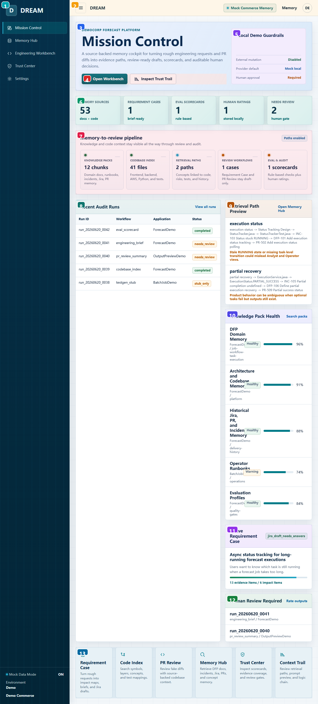

| 编号 | 区域 | 用户功能 | 实现/状态来源 | 开发注意 |
| --- | --- | --- | --- | --- |
| 1 | 全局左侧导航 | 主导航：DREAM brand、五个顶层页面、mock/demo 环境状态。 | AppComponent navItems + sidebar-footer，routerLink 导航。 | 跨页固定 shell；改 navItems 会影响所有截图/入口。 |
| 2 | 全局顶部栏 | 移动菜单按钮、当前产品标识、mock memory chip、Memory 快捷入口、demo 用户头像。 | app.component.html topbar；Toggle navigation 目前只有按钮外观，没有绑定展开逻辑。 | Toggle navigation 尚未实现行为；如做响应式菜单需补状态和测试。 |
| 3 | 页面主叙事与入口 | 告诉用户 DREAM 的定位，并提供进入 Workbench 和 Trust Trail 的两个主入口。 | DashboardComponent 的 hero 区，链接到 /workbench 和 /trust。 | 产品校验时确认 mock 行为和未来生产行为差异是否已说明。 |
| 4 | 主工作流按钮 | Open Workbench 进入需求/PR 工作流；Inspect Trust Trail 查看可审计证据链。 | routerLink 导航，无业务 side effect。 | 导航无 side effect，适合 demo；真实 workflow 需补权限/状态保护。 |
| 5 | 本地演示护栏 | 展示当前 demo 是否允许外部修改、默认 provider、是否需要人工审批。 | 静态 guardrails 数组，说明 mock/demo 安全边界。 | 产品校验时确认 mock 行为和未来生产行为差异是否已说明。 |
| 6 | 关键指标条 | 快速看当前 mock memory、case、scorecard、rating、待 review 数量。 | 由 MockDreamService 聚合 chunks/files/cases/ratings 计算。 | 产品校验时确认 mock 行为和未来生产行为差异是否已说明。 |
| 7 | Memory-to-review pipeline | 展示从知识包、代码索引、检索路径到 review/audit 的端到端链路。 | pipelineSteps computed；每个 step 是 routerLink。 | 导航无 side effect，适合 demo；真实 workflow 需补权限/状态保护。 |
| 8 | Recent Audit Runs | 最近生成/审计 run 的状态表，用于判断哪些输出失败、通过或待审。 | recentRuns mock table，状态 pill 基于 run.status 映射。 | 产品校验时确认 mock 行为和未来生产行为差异是否已说明。 |
| 9 | Retrieval Path Preview | 预览业务概念如何映射到 evidence path。 | searchEvidenceGraph 默认 query=execution status。 | 产品校验时确认 mock 行为和未来生产行为差异是否已说明。 |
| 10 | Knowledge Pack Health | 查看知识包覆盖率和健康状态，定位缺失/危险知识源。 | listKnowledgePacks 的 coverage/status 展示。 | 产品校验时确认 mock 行为和未来生产行为差异是否已说明。 |
| 11 | Active Requirement Case | 当前最重要需求 case 的摘要、置信度和 evidence/impact 数量。 | primaryCase() 取 requirementCases()[0]。 | 产品校验时确认 mock 行为和未来生产行为差异是否已说明。 |
| 12 | Human Review Required | 列出需要人工确认的 run，提醒不能自动发布。 | needsReview computed 过滤 needs_review/warning。 | 产品校验时确认 mock 行为和未来生产行为差异是否已说明。 |
| 13 | Quick Actions | 快捷进入需求、代码索引、PR review、Memory、Trust、Context Trail。 | quickActions 静态配置，均为 routerLink。 | 导航无 side effect，适合 demo；真实 workflow 需补权限/状态保护。 |

### Memory Hub {#memory-hub-dev}

- Route：`/memory`
- Component：`frontend/src/app/features/memory-hub/memory-hub.component.ts`
- 目的：Memory Hub 总览页，管理 source evidence 到 approved workflow context 的闭环。

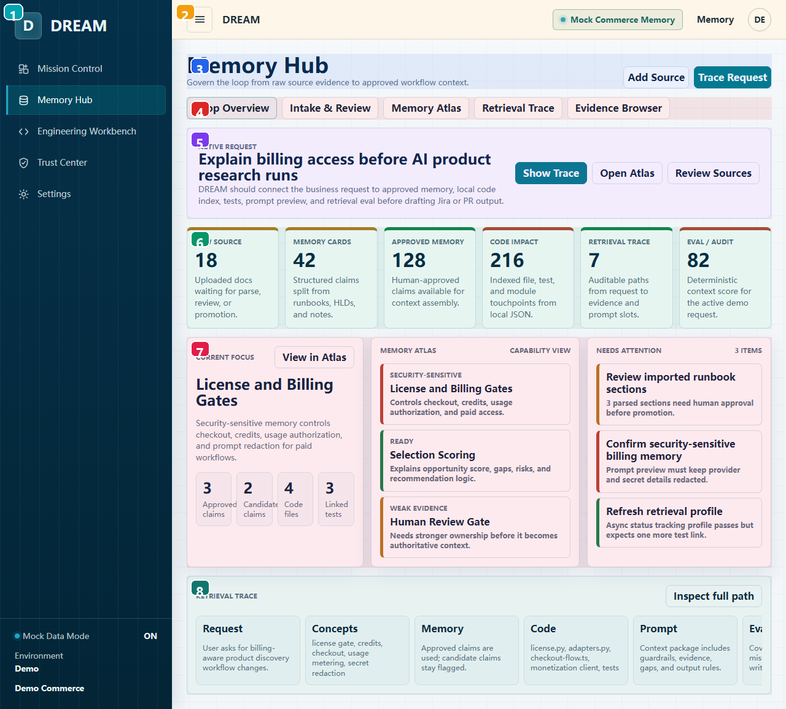

| 编号 | 区域 | 用户功能 | 实现/状态来源 | 开发注意 |
| --- | --- | --- | --- | --- |
| 1 | 全局左侧导航 | 主导航：DREAM brand、五个顶层页面、mock/demo 环境状态。 | AppComponent navItems + sidebar-footer，routerLink 导航。 | 跨页固定 shell；改 navItems 会影响所有截图/入口。 |
| 2 | 全局顶部栏 | 移动菜单按钮、当前产品标识、mock memory chip、Memory 快捷入口、demo 用户头像。 | app.component.html topbar；Toggle navigation 目前只有按钮外观，没有绑定展开逻辑。 | Toggle navigation 尚未实现行为；如做响应式菜单需补状态和测试。 |
| 3 | Memory Hub 标题与动作 | Add Source 切到 Intake；Trace Request 切到检索轨迹。 | openIntake/openTrace 只更新 activeTab signal。 | 刷新会重置；生产化需接 API/持久化。 |
| 4 | Hub 内部 Tabs | 切换 Loop Overview、Intake、Atlas、Trace、Evidence 五个内嵌视图。 | activeTab signal 控制嵌入组件。 | 刷新会重置；生产化需接 API/持久化。 |
| 5 | Active Request 卡片 | 当前示例请求和 Show Trace/Open Atlas/Review Sources 快捷入口。 | 按钮分别切换 trace/atlas/intake tab。 | 产品校验时确认 mock 行为和未来生产行为差异是否已说明。 |
| 6 | Memory Loop Stages | 显示 raw source 到 eval/audit 的每一步数量和状态。 | loopStages 静态数组，data-state 控制样式。 | 产品校验时确认 mock 行为和未来生产行为差异是否已说明。 |
| 7 | Overview Focus Grid | 当前关注 capability、atlas 高亮、待处理事项。 | focusMetrics/atlasHighlights/activeWork 展示；按钮切换内部 tab。 | 产品校验时确认 mock 行为和未来生产行为差异是否已说明。 |
| 8 | Retrieval Trace Preview | 预览 request -> concepts -> memory -> code -> prompt -> eval 的链路。 | traceSteps 静态数组，Inspect full path 切 trace tab。 | 产品校验时确认 mock 行为和未来生产行为差异是否已说明。 |

### Engineering Workbench {#engineering-workbench-dev}

- Route：`/workbench`
- Component：`frontend/src/app/features/engineering-workbench/engineering-workbench.component.ts`
- 目的：需求分析和 PR Review 的工作台容器，旁边固定显示 context trust sidebar。

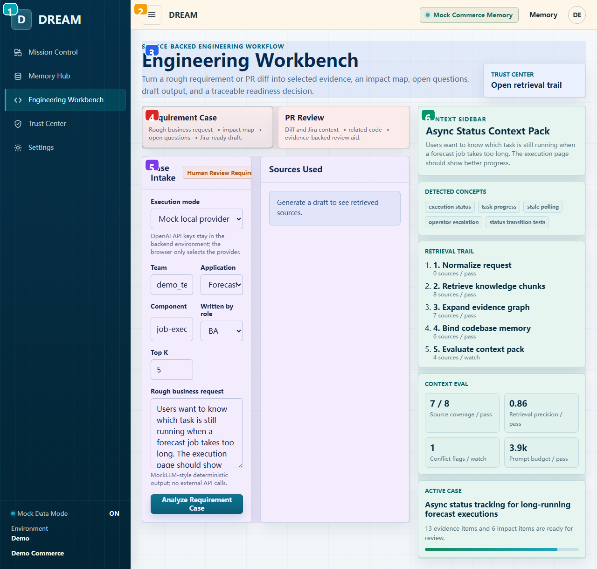

| 编号 | 区域 | 用户功能 | 实现/状态来源 | 开发注意 |
| --- | --- | --- | --- | --- |
| 1 | 全局左侧导航 | 主导航：DREAM brand、五个顶层页面、mock/demo 环境状态。 | AppComponent navItems + sidebar-footer，routerLink 导航。 | 跨页固定 shell；改 navItems 会影响所有截图/入口。 |
| 2 | 全局顶部栏 | 移动菜单按钮、当前产品标识、mock memory chip、Memory 快捷入口、demo 用户头像。 | app.component.html topbar；Toggle navigation 目前只有按钮外观，没有绑定展开逻辑。 | Toggle navigation 尚未实现行为；如做响应式菜单需补状态和测试。 |
| 3 | Workbench 标题与 Trust 入口 | 说明工作台目的，右侧 Trust Center 链接用于打开检索审计。 | trust-link routerLink=/trust。 | 导航无 side effect，适合 demo；真实 workflow 需补权限/状态保护。 |
| 4 | Workflow Mode Switch | 在 Requirement Case 与 PR Review 两种工作模式间切换。 | activeMode signal 控制 app-requirement-draft/app-pr-review。 | 刷新会重置；生产化需接 API/持久化。 |
| 5 | 嵌入工作流区域 | 当前模式的实际表单和结果输出区。 | 默认 requirement；PR 模式复用 PrReviewComponent。 | 产品校验时确认 mock 行为和未来生产行为差异是否已说明。 |
| 6 | Context Sidebar | 持续显示检测到的概念、检索 trail、context eval 和 active case。 | 由 getContextIntelligenceSnapshot + primaryCase mock 数据驱动。 | 产品校验时确认 mock 行为和未来生产行为差异是否已说明。 |

### Trust Center {#trust-center-dev}

- Route：`/trust`
- Component：`frontend/src/app/features/trust-center/trust-center.component.ts`
- 目的：检索可信度、prompt preview、eval/audit 和 human rating 的治理入口。

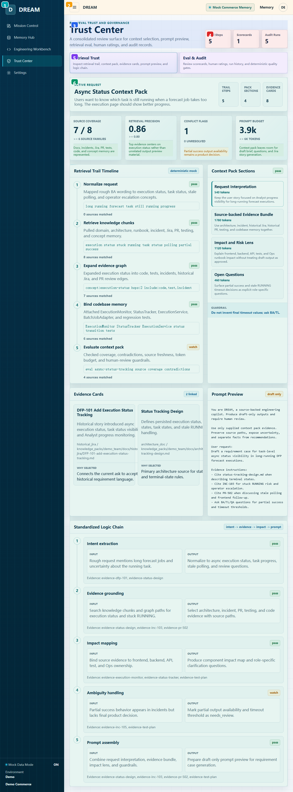

| 编号 | 区域 | 用户功能 | 实现/状态来源 | 开发注意 |
| --- | --- | --- | --- | --- |
| 1 | 全局左侧导航 | 主导航：DREAM brand、五个顶层页面、mock/demo 环境状态。 | AppComponent navItems + sidebar-footer，routerLink 导航。 | 跨页固定 shell；改 navItems 会影响所有截图/入口。 |
| 2 | 全局顶部栏 | 移动菜单按钮、当前产品标识、mock memory chip、Memory 快捷入口、demo 用户头像。 | app.component.html topbar；Toggle navigation 目前只有按钮外观，没有绑定展开逻辑。 | Toggle navigation 尚未实现行为；如做响应式菜单需补状态和测试。 |
| 3 | Trust Center 标题 | 解释这是 review/governance 面板。 | TrustCenterComponent 容器页。 | 产品校验时确认 mock 行为和未来生产行为差异是否已说明。 |
| 4 | 汇总数字 | 快速看 trail steps、scorecards、audit runs 数量。 | snapshot/auditRuns/scorecards 数据聚合。 | 产品校验时确认 mock 行为和未来生产行为差异是否已说明。 |
| 5 | Trust Tabs | 切换 Retrieval Trust 和 Eval & Audit。 | activeTab signal 控制 ContextIntelligence 或 AuditEval。 | 刷新会重置；生产化需接 API/持久化。 |
| 6 | 嵌入治理视图 | 当前 tab 的实际 trust/audit 内容。 | 默认加载 app-context-intelligence。 | 产品校验时确认 mock 行为和未来生产行为差异是否已说明。 |

### Knowledge Memory {#knowledge-memory-dev}

- Route：`/knowledge`
- Component：`frontend/src/app/features/knowledge-base/knowledge-base.component.ts`
- 目的：知识源搜索和 chunk 预览页面，用于查 domain docs/runbooks/incidents/Jira/PR/test docs。

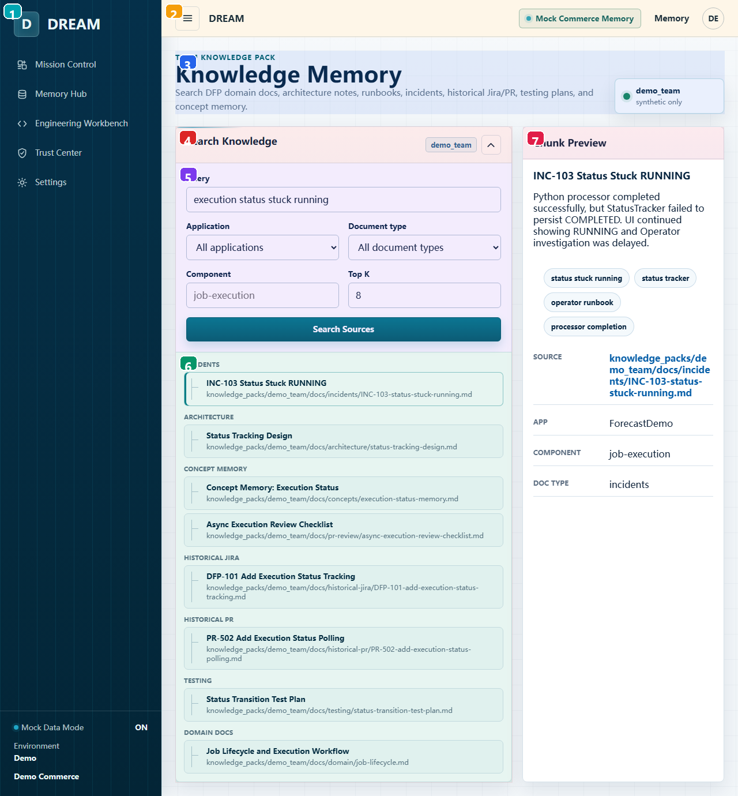

| 编号 | 区域 | 用户功能 | 实现/状态来源 | 开发注意 |
| --- | --- | --- | --- | --- |
| 1 | 全局左侧导航 | 主导航：DREAM brand、五个顶层页面、mock/demo 环境状态。 | AppComponent navItems + sidebar-footer，routerLink 导航。 | 跨页固定 shell；改 navItems 会影响所有截图/入口。 |
| 2 | 全局顶部栏 | 移动菜单按钮、当前产品标识、mock memory chip、Memory 快捷入口、demo 用户头像。 | app.component.html topbar；Toggle navigation 目前只有按钮外观，没有绑定展开逻辑。 | Toggle navigation 尚未实现行为；如做响应式菜单需补状态和测试。 |
| 3 | 页面说明与索引状态 | 说明当前搜索 demo_team synthetic knowledge pack。 | index-beacon 静态显示 synthetic only。 | 产品校验时确认 mock 行为和未来生产行为差异是否已说明。 |
| 4 | 搜索与筛选面板 | 输入 query、app、doc type、component、Top K 后搜索来源。 | Reactive form 调 dream.searchKnowledge 并更新 chunks/selectedChunk。 | 产品校验时确认 mock 行为和未来生产行为差异是否已说明。 |
| 5 | 展开后的搜索表单 | 高级过滤条件，搜索后会自动折叠并更新结果。 | searchCollapsed signal 控制。 | 刷新会重置；生产化需接 API/持久化。 |
| 6 | Knowledge Source Tree | 按 source type 分组展示命中的 chunk，点击任意 chunk 查看右侧详情。 | sourceGroups computed 按 sourceType group。 | 产品校验时确认 mock 行为和未来生产行为差异是否已说明。 |
| 7 | Chunk Preview | 查看选中 chunk 的摘要、概念标签、metadata 和 GitHub source link。 | selectedChunk signal；concept 按钮会回填 query 并 search。 | 刷新会重置；生产化需接 API/持久化。 |

### Knowledge Intake {#knowledge-intake-dev}

- Route：`/knowledge-intake`
- Component：`frontend/src/app/features/knowledge-intake/knowledge-intake.component.ts`
- 目的：把上传/导入的 source parse 成候选 memory cards，并经过 approve/promote 流程。

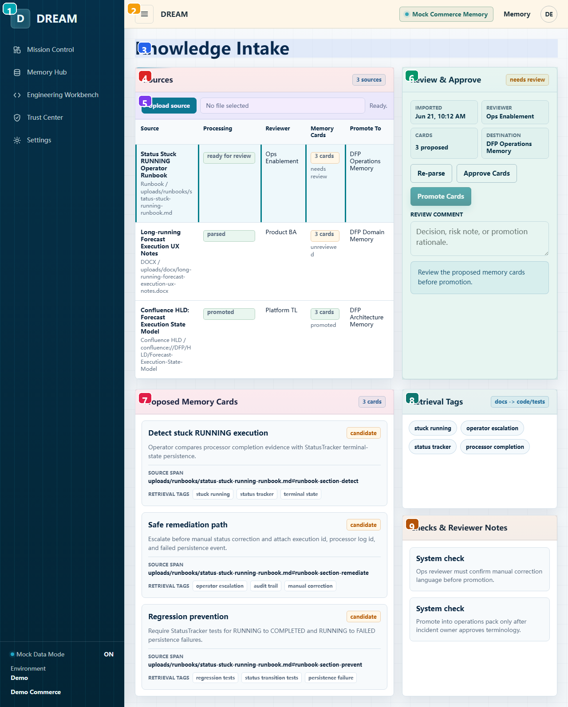

| 编号 | 区域 | 用户功能 | 实现/状态来源 | 开发注意 |
| --- | --- | --- | --- | --- |
| 1 | 全局左侧导航 | 主导航：DREAM brand、五个顶层页面、mock/demo 环境状态。 | AppComponent navItems + sidebar-footer，routerLink 导航。 | 跨页固定 shell；改 navItems 会影响所有截图/入口。 |
| 2 | 全局顶部栏 | 移动菜单按钮、当前产品标识、mock memory chip、Memory 快捷入口、demo 用户头像。 | app.component.html topbar；Toggle navigation 目前只有按钮外观，没有绑定展开逻辑。 | Toggle navigation 尚未实现行为；如做响应式菜单需补状态和测试。 |
| 3 | Intake 标题 | 进入 source intake/review 工作台。 | KnowledgeIntakeComponent standalone route。 | 产品校验时确认 mock 行为和未来生产行为差异是否已说明。 |
| 4 | Sources Queue | 展示待处理 source、解析状态、reviewer、memory card 数量和目标 pack。 | queue signal 来自 listKnowledgeIntakeQueue。 | 刷新会重置；生产化需接 API/持久化。 |
| 5 | Upload Source | 上传 md/txt/docx/html/json；本地读取并解析成 proposed memory cards。 | File.text() + buildUploadedIntakeItem，不调用后端。 | 产品校验时确认 mock 行为和未来生产行为差异是否已说明。 |
| 6 | Review & Approve Console | 对选中 source 进行 re-parse、approve、promote，并记录 review comment。 | reparse/approve/promote 更新 queue signal。 | 刷新会重置；生产化需接 API/持久化。 |
| 7 | Proposed Memory Cards | 展示解析出来的候选 memory cards、摘要、source span 和 retrieval tags。 | item.sections 渲染，状态取决于 reviewStatus。 | 产品校验时确认 mock 行为和未来生产行为差异是否已说明。 |
| 8 | Retrieval Tags | 解析出的概念标签，用于后续检索匹配。 | item.parsedConcepts 展示，不可编辑。 | 产品校验时确认 mock 行为和未来生产行为差异是否已说明。 |
| 9 | Checks & Reviewer Notes | 系统检查和人工 review note 的审计说明。 | reviewNotes 数组，comment 文案会插入。 | 产品校验时确认 mock 行为和未来生产行为差异是否已说明。 |

### Memory Atlas {#memory-atlas-dev}

- Route：`/codebase`
- Component：`frontend/src/app/features/codebase-memory/codebase-memory.component.ts`
- 目的：代码库 capability memory atlas，把业务能力、代码文件、测试、风险和 prompt 用途连接起来。

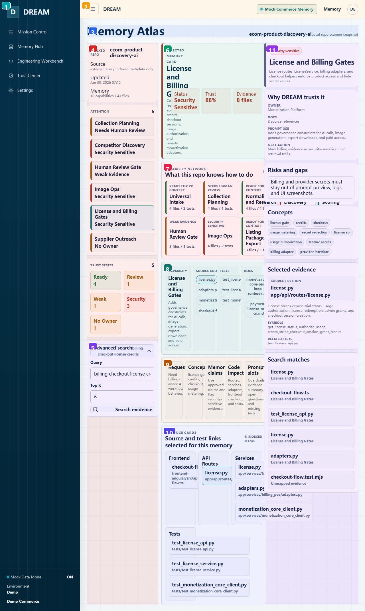

| 编号 | 区域 | 用户功能 | 实现/状态来源 | 开发注意 |
| --- | --- | --- | --- | --- |
| 1 | 全局左侧导航 | 主导航：DREAM brand、五个顶层页面、mock/demo 环境状态。 | AppComponent navItems + sidebar-footer，routerLink 导航。 | 跨页固定 shell；改 navItems 会影响所有截图/入口。 |
| 2 | 全局顶部栏 | 移动菜单按钮、当前产品标识、mock memory chip、Memory 快捷入口、demo 用户头像。 | app.component.html topbar；Toggle navigation 目前只有按钮外观，没有绑定展开逻辑。 | Toggle navigation 尚未实现行为；如做响应式菜单需补状态和测试。 |
| 3 | Atlas 标题与 Repo 状态 | 说明当前索引的 repo 和 provider snapshot。 | repoName/providerLabel/indexedAt 静态 mock。 | 产品校验时确认 mock 行为和未来生产行为差异是否已说明。 |
| 4 | 左侧 Atlas Rail | 查看 indexed repo、attention queue、trust states 和高级搜索。 | reviewQueue/healthStats/searchCollapsed 驱动。 | 产品校验时确认 mock 行为和未来生产行为差异是否已说明。 |
| 5 | Advanced Search | 按 query/topK 搜索代码 evidence，并选中第一个 match。 | dream.searchCodebase 更新 results 和 selectedFile。 | 产品校验时确认 mock 行为和未来生产行为差异是否已说明。 |
| 6 | Selected Memory Hero | 当前选中 capability 的摘要、状态、trust 和 evidence 数量。 | selectedCapability computed。 | 产品校验时确认 mock 行为和未来生产行为差异是否已说明。 |
| 7 | Capability Network | 点击 capability node 切换上下文，查看能力之间的关联。 | selectCapability 更新 selectedCapabilityId/selectedFileId。 | 产品校验时确认 mock 行为和未来生产行为差异是否已说明。 |
| 8 | Impact Map | 把能力拆成 source code、tests、docs，可点击具体文件/路径。 | selectedFiles/selectedTests/selectedDocs computed。 | 产品校验时确认 mock 行为和未来生产行为差异是否已说明。 |
| 9 | Prompt Assembly Trace | 说明 request 到 prompt slots 的组装步骤。 | traceSteps 静态数组。 | 产品校验时确认 mock 行为和未来生产行为差异是否已说明。 |
| 10 | Evidence Library | 按 frontend/API/service/domain/tests 分组列出当前 capability 的 evidence。 | evidenceGroups computed。 | 产品校验时确认 mock 行为和未来生产行为差异是否已说明。 |
| 11 | Decision Inspector | 右侧查看为什么信任、风险缺口、概念、选中 evidence 和搜索 matches。 | selectedCapability/selectedFile/results 联动展示。 | 产品校验时确认 mock 行为和未来生产行为差异是否已说明。 |

### Retrieval Paths {#retrieval-paths-dev}

- Route：`/graph`
- Component：`frontend/src/app/features/evidence-graph/evidence-graph.component.ts`
- 目的：按业务概念查 docs -> code -> tests 的 evidence graph path。

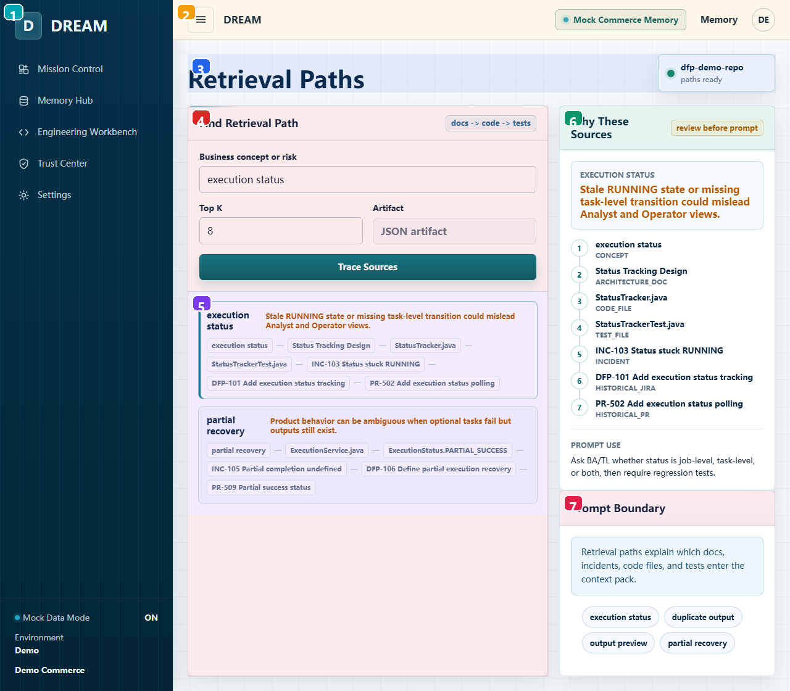

| 编号 | 区域 | 用户功能 | 实现/状态来源 | 开发注意 |
| --- | --- | --- | --- | --- |
| 1 | 全局左侧导航 | 主导航：DREAM brand、五个顶层页面、mock/demo 环境状态。 | AppComponent navItems + sidebar-footer，routerLink 导航。 | 跨页固定 shell；改 navItems 会影响所有截图/入口。 |
| 2 | 全局顶部栏 | 移动菜单按钮、当前产品标识、mock memory chip、Memory 快捷入口、demo 用户头像。 | app.component.html topbar；Toggle navigation 目前只有按钮外观，没有绑定展开逻辑。 | Toggle navigation 尚未实现行为；如做响应式菜单需补状态和测试。 |
| 3 | 页面标题与图谱状态 | 显示当前 demo repo 的 graph path ready 状态。 | EvidenceGraphComponent route。 | 产品校验时确认 mock 行为和未来生产行为差异是否已说明。 |
| 4 | Find Retrieval Path 表单 | 输入 business concept/risk 和 topK 后 trace sources。 | Reactive form 调 searchEvidenceGraph。 | 产品校验时确认 mock 行为和未来生产行为差异是否已说明。 |
| 5 | Graph Path Results | 点击结果选择某条 evidence path。 | selectedPath signal 更新右侧 Why These Sources。 | 刷新会重置；生产化需接 API/持久化。 |
| 6 | Why These Sources | 解释选中 path 中每个节点为什么进入 prompt context。 | path.path/evidenceTypes/reviewHint 展示。 | 产品校验时确认 mock 行为和未来生产行为差异是否已说明。 |
| 7 | Prompt Boundary | 提醒哪些 docs/incidents/code/tests 会进入 context pack，并提供快捷 query。 | 快捷按钮 patchValue + search。 | 产品校验时确认 mock 行为和未来生产行为差异是否已说明。 |

### Context Intelligence {#context-intelligence-dev}

- Route：`/context-intelligence`
- Component：`frontend/src/app/features/context-intelligence/context-intelligence.component.ts`
- 目的：展示 intent 到 source-backed context pack、prompt preview、logic chain 的完整组装过程。

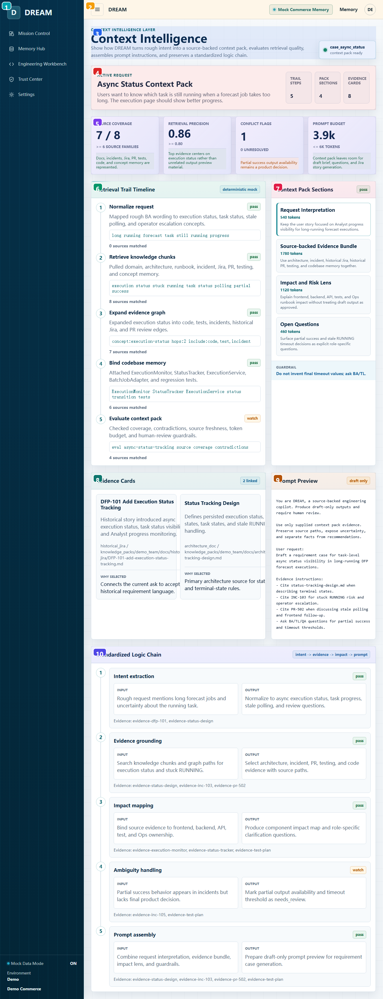

| 编号 | 区域 | 用户功能 | 实现/状态来源 | 开发注意 |
| --- | --- | --- | --- | --- |
| 1 | 全局左侧导航 | 主导航：DREAM brand、五个顶层页面、mock/demo 环境状态。 | AppComponent navItems + sidebar-footer，routerLink 导航。 | 跨页固定 shell；改 navItems 会影响所有截图/入口。 |
| 2 | 全局顶部栏 | 移动菜单按钮、当前产品标识、mock memory chip、Memory 快捷入口、demo 用户头像。 | app.component.html topbar；Toggle navigation 目前只有按钮外观，没有绑定展开逻辑。 | Toggle navigation 尚未实现行为；如做响应式菜单需补状态和测试。 |
| 3 | Context 页面说明 | 说明当前 caseId 和 context pack ready 状态。 | snapshot 来自 getContextIntelligenceSnapshot。 | 产品校验时确认 mock 行为和未来生产行为差异是否已说明。 |
| 4 | Active Request Summary | 当前请求、trail/pack/evidence 的摘要计数。 | snapshot.title/request/sections/evidenceCards。 | 产品校验时确认 mock 行为和未来生产行为差异是否已说明。 |
| 5 | Retrieval Eval Metrics | 衡量 coverage、freshness、source mix 等检索质量。 | snapshot.metrics + statusClass。 | 产品校验时确认 mock 行为和未来生产行为差异是否已说明。 |
| 6 | Retrieval Trail Timeline | 逐步展示 query、匹配 source 数和状态。 | retrievalTrail 渲染。 | 产品校验时确认 mock 行为和未来生产行为差异是否已说明。 |
| 7 | Context Pack Sections | 点击 section 查看该 section 的 guardrail 和 linked evidence。 | selectedSectionId signal 控制 selectedEvidence。 | 刷新会重置；生产化需接 API/持久化。 |
| 8 | Evidence Cards | 显示当前 section 绑定的 source excerpt、relevance 和 why selected。 | selectedEvidence computed。 | 产品校验时确认 mock 行为和未来生产行为差异是否已说明。 |
| 9 | Prompt Preview | 查看最终将送给模型的 system/developer/user/evidence instructions 预览。 | promptText computed 拼装；draft only。 | 产品校验时确认 mock 行为和未来生产行为差异是否已说明。 |
| 10 | Standardized Logic Chain | 标准化记录 input/output/evidence，方便审计和复盘。 | snapshot.logicChain 渲染。 | 产品校验时确认 mock 行为和未来生产行为差异是否已说明。 |

### Requirement Case {#requirement-case-dev}

- Route：`/requirements`
- Component：`frontend/src/app/features/requirement-draft/requirement-draft.component.ts`
- 目的：把粗糙业务需求转为 evidence、impact map、澄清问题、scorecard 和 Jira draft。

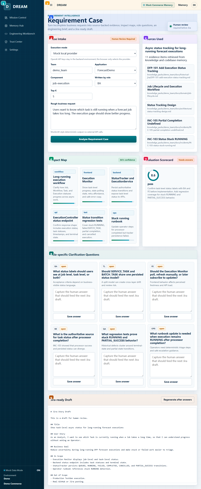

| 编号 | 区域 | 用户功能 | 实现/状态来源 | 开发注意 |
| --- | --- | --- | --- | --- |
| 1 | 全局左侧导航 | 主导航：DREAM brand、五个顶层页面、mock/demo 环境状态。 | AppComponent navItems + sidebar-footer，routerLink 导航。 | 跨页固定 shell；改 navItems 会影响所有截图/入口。 |
| 2 | 全局顶部栏 | 移动菜单按钮、当前产品标识、mock memory chip、Memory 快捷入口、demo 用户头像。 | app.component.html topbar；Toggle navigation 目前只有按钮外观，没有绑定展开逻辑。 | Toggle navigation 尚未实现行为；如做响应式菜单需补状态和测试。 |
| 3 | 页面目标与人工门禁 | 说明输出必须人工 review 后才能进 Jira。 | RequirementDraftComponent route。 | 产品校验时确认 mock 行为和未来生产行为差异是否已说明。 |
| 4 | Case Intake 表单 | 选择 execution mode、team/app/component/role/topK，输入 rough request 并分析。 | Reactive form + Validators；默认 mock。 | real mode 错误处理要覆盖后端未启动、CORS、provider key 缺失。 |
| 5 | Sources Used | 生成后展示检索到的来源和 source path。 | result.sourcesUsed。 | 产品校验时确认 mock 行为和未来生产行为差异是否已说明。 |
| 6 | Impact Map | 显示需求可能影响的系统区域、描述和置信度。 | requirementCase.impactMap。 | 产品校验时确认 mock 行为和未来生产行为差异是否已说明。 |
| 7 | Evaluation Scorecard | 用分数和建议判断是否 Jira-ready 或仍需答案。 | draft.scorecard + readinessLabel。 | 产品校验时确认 mock 行为和未来生产行为差异是否已说明。 |
| 8 | Role-specific Questions | 不同角色需要回答的问题，可保存答案回填到 case。 | questionAnswers signal + saveQuestionAnswer。 | 刷新会重置；生产化需接 API/持久化。 |
| 9 | Jira-ready Draft | 查看/重新生成带人工答案的 Jira markdown 草稿。 | regenerateJiraDraft 只更新本地 result。 | 产品校验时确认 mock 行为和未来生产行为差异是否已说明。 |

### PR Review {#pr-review-dev}

- Route：`/review`
- Component：`frontend/src/app/features/pr-review/pr-review.component.ts`
- 目的：用 synthetic diff/Jira context 生成 evidence-backed PR review aid。

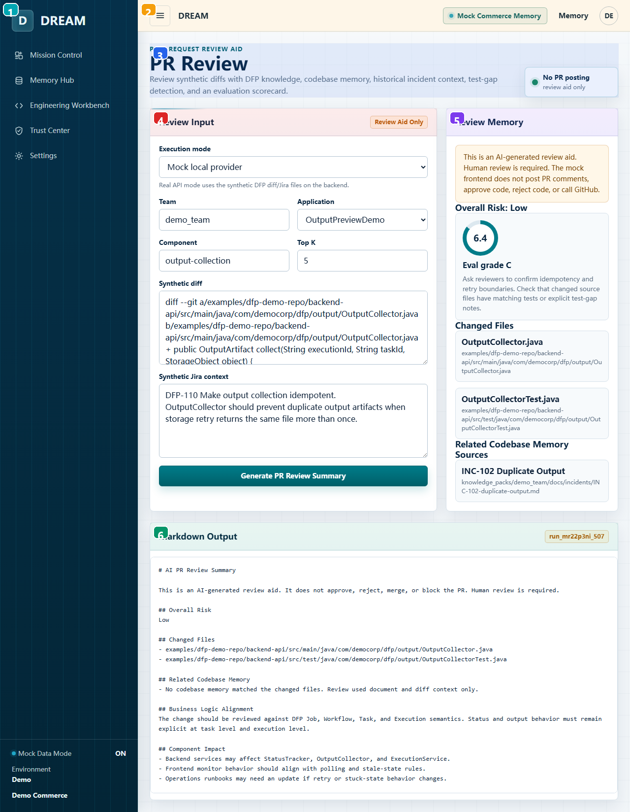

| 编号 | 区域 | 用户功能 | 实现/状态来源 | 开发注意 |
| --- | --- | --- | --- | --- |
| 1 | 全局左侧导航 | 主导航：DREAM brand、五个顶层页面、mock/demo 环境状态。 | AppComponent navItems + sidebar-footer，routerLink 导航。 | 跨页固定 shell；改 navItems 会影响所有截图/入口。 |
| 2 | 全局顶部栏 | 移动菜单按钮、当前产品标识、mock memory chip、Memory 快捷入口、demo 用户头像。 | app.component.html topbar；Toggle navigation 目前只有按钮外观，没有绑定展开逻辑。 | Toggle navigation 尚未实现行为；如做响应式菜单需补状态和测试。 |
| 3 | 页面目标与安全边界 | 明确不发 PR comment、不 approve/reject，只生成 review aid。 | PrReviewComponent route。 | 产品校验时确认 mock 行为和未来生产行为差异是否已说明。 |
| 4 | Review Input 表单 | 选择 mode/team/app/component/topK，输入 synthetic diff 和 Jira context。 | Reactive form；默认 MOCK_DIFF_TEXT/MOCK_JIRA_CONTEXT。 | real mode 错误处理要覆盖后端未启动、CORS、provider key 缺失。 |
| 5 | Review Memory | 查看风险等级、eval grade、changed files、related code 和 sources。 | result 后展示 review.risk/scorecard/relatedCode。 | 产品校验时确认 mock 行为和未来生产行为差异是否已说明。 |
| 6 | Markdown Output | 生成可复制给 reviewer 的 markdown 摘要。 | review.markdown；不调用 GitHub。 | 产品校验时确认 mock 行为和未来生产行为差异是否已说明。 |

### TestGen Stub {#testgen-stub-dev}

- Route：`/testgen`
- Component：`frontend/src/app/features/testgen-stub/testgen-stub.component.ts`
- 目的：展示未来 TestGen provider 接口，但当前不生成测试、不写 repo。

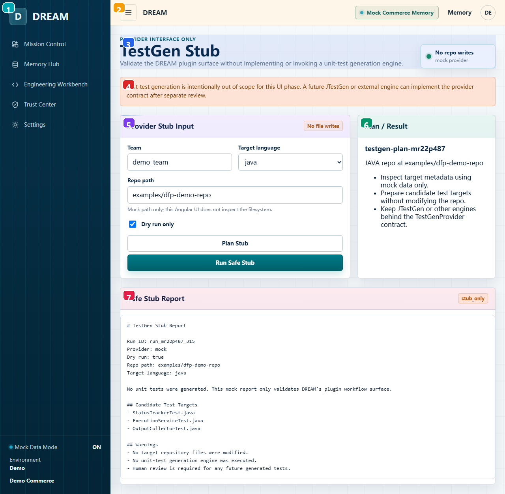

| 编号 | 区域 | 用户功能 | 实现/状态来源 | 开发注意 |
| --- | --- | --- | --- | --- |
| 1 | 全局左侧导航 | 主导航：DREAM brand、五个顶层页面、mock/demo 环境状态。 | AppComponent navItems + sidebar-footer，routerLink 导航。 | 跨页固定 shell；改 navItems 会影响所有截图/入口。 |
| 2 | 全局顶部栏 | 移动菜单按钮、当前产品标识、mock memory chip、Memory 快捷入口、demo 用户头像。 | app.component.html topbar；Toggle navigation 目前只有按钮外观，没有绑定展开逻辑。 | Toggle navigation 尚未实现行为；如做响应式菜单需补状态和测试。 |
| 3 | 页面目标与 Stub 边界 | 说明这是 provider interface only，mock provider，无 repo 写入。 | TestgenStubComponent route。 | 产品校验时确认 mock 行为和未来生产行为差异是否已说明。 |
| 4 | 范围警告 | 提醒 unit-test generation 不在当前 UI phase。 | 静态 guardrail 文案。 | 产品校验时确认 mock 行为和未来生产行为差异是否已说明。 |
| 5 | Provider Stub Input | 输入 team、语言、repo path，保持 dry run only。 | Reactive form；UI 不读 filesystem。 | 产品校验时确认 mock 行为和未来生产行为差异是否已说明。 |
| 6 | Plan / Result | Plan Stub 预览要做的动作。 | dream.planTestGenStub。 | 产品校验时确认 mock 行为和未来生产行为差异是否已说明。 |
| 7 | Safe Stub Report | Run Safe Stub 生成安全报告，证明不会写文件。 | dream.runTestGenStub。 | 产品校验时确认 mock 行为和未来生产行为差异是否已说明。 |

### Eval & Audit {#eval-audit-dev}

- Route：`/audit`
- Component：`frontend/src/app/features/audit-eval/audit-eval.component.ts`
- 目的：查看 deterministic scorecards、run history、human ratings 和 evidence coverage。

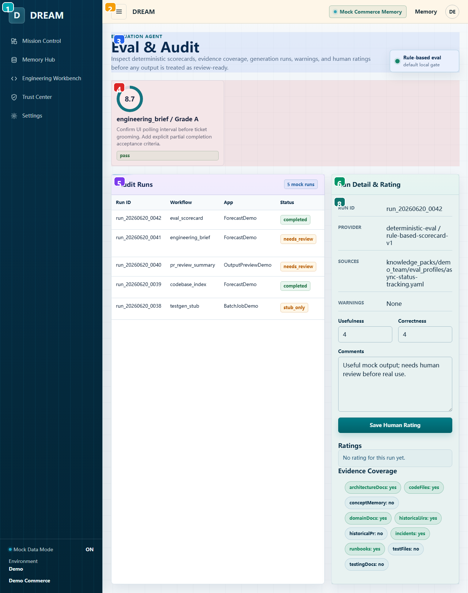

| 编号 | 区域 | 用户功能 | 实现/状态来源 | 开发注意 |
| --- | --- | --- | --- | --- |
| 1 | 全局左侧导航 | 主导航：DREAM brand、五个顶层页面、mock/demo 环境状态。 | AppComponent navItems + sidebar-footer，routerLink 导航。 | 跨页固定 shell；改 navItems 会影响所有截图/入口。 |
| 2 | 全局顶部栏 | 移动菜单按钮、当前产品标识、mock memory chip、Memory 快捷入口、demo 用户头像。 | app.component.html topbar；Toggle navigation 目前只有按钮外观，没有绑定展开逻辑。 | Toggle navigation 尚未实现行为；如做响应式菜单需补状态和测试。 |
| 3 | Audit 页面说明 | 说明输出在 review-ready 前需要 eval 和人工评分。 | AuditEvalComponent route。 | 产品校验时确认 mock 行为和未来生产行为差异是否已说明。 |
| 4 | Evaluation Scorecards | 分数、grade、recommendation 和 pass/warning/fail 状态。 | scorecards signal。 | 刷新会重置；生产化需接 API/持久化。 |
| 5 | Audit Runs Table | 点击 run 查看详情和评分。 | selectRun 更新 selectedRun。 | 产品校验时确认 mock 行为和未来生产行为差异是否已说明。 |
| 6 | Run Detail & Rating | 查看 provider、sources、warnings，并填写 usefulness/correctness/comment。 | ratingForm + submitRating。 | 产品校验时确认 mock 行为和未来生产行为差异是否已说明。 |
| 7 | Ratings List | 展示当前 run 已保存的人类评分。 | selectedRatings computed 从 ratings 过滤。 | 产品校验时确认 mock 行为和未来生产行为差异是否已说明。 |
| 8 | Evidence Coverage | 展示知识/代码/测试/历史等来源覆盖情况。 | scorecards()[0].sourceCoverage keyvalue。 | 产品校验时确认 mock 行为和未来生产行为差异是否已说明。 |

### Settings {#settings-dev}

- Route：`/settings`
- Component：`frontend/src/app/features/settings/settings.component.ts`
- 目的：运行模式和 guardrails 的只读配置预览。

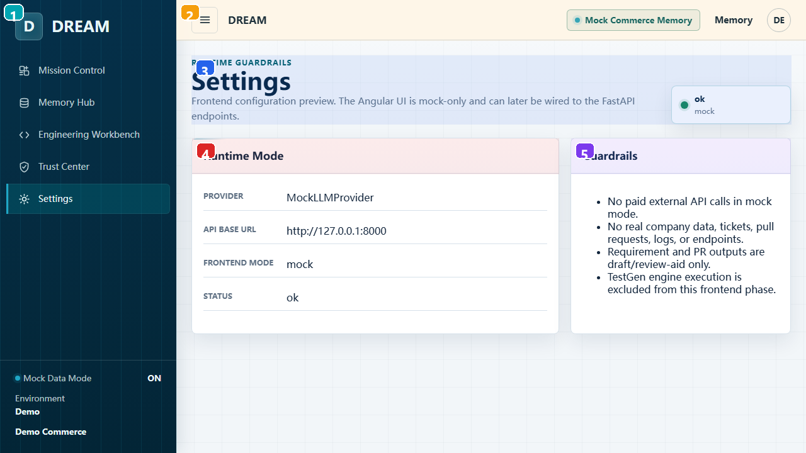

| 编号 | 区域 | 用户功能 | 实现/状态来源 | 开发注意 |
| --- | --- | --- | --- | --- |
| 1 | 全局左侧导航 | 主导航：DREAM brand、五个顶层页面、mock/demo 环境状态。 | AppComponent navItems + sidebar-footer，routerLink 导航。 | 跨页固定 shell；改 navItems 会影响所有截图/入口。 |
| 2 | 全局顶部栏 | 移动菜单按钮、当前产品标识、mock memory chip、Memory 快捷入口、demo 用户头像。 | app.component.html topbar；Toggle navigation 目前只有按钮外观，没有绑定展开逻辑。 | Toggle navigation 尚未实现行为；如做响应式菜单需补状态和测试。 |
| 3 | Settings 页面说明 | 查看 frontend mock-only 状态和健康标识。 | SettingsComponent 注入 MockDreamService。 | 产品校验时确认 mock 行为和未来生产行为差异是否已说明。 |
| 4 | Runtime Mode | 查看 provider、API base URL、frontend mode、status。 | dream.health 静态配置，base URL 指向 127.0.0.1:8000。 | 产品校验时确认 mock 行为和未来生产行为差异是否已说明。 |
| 5 | Guardrails | 当前 demo 的安全边界：无付费外部 API、无真实公司数据、输出仅草稿、TestGen excluded。 | 静态列表，面向 demo governance。 | 产品校验时确认 mock 行为和未来生产行为差异是否已说明。 |
