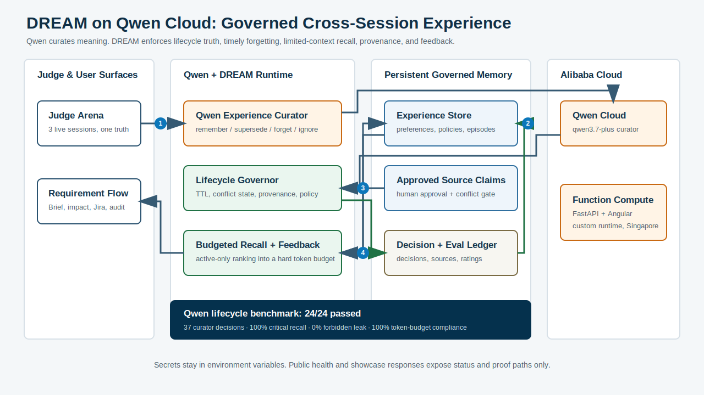

<!-- SPDX-License-Identifier: Apache-2.0 -->

# Qwen Cloud Architecture

Devpost upload asset: [`assets/qwencloud-architecture.png`](assets/qwencloud-architecture.png).
Regenerate it with `scripts/qwencloud-export-architecture-png.ps1`.

## Runtime Path

1. User opens the Angular workbench or calls the FastAPI API.
2. DREAM retrieves durable memory from knowledge packs, codebase indexes,
   approved memory claims, evidence graphs, and audit/eval history.
3. The prompt is assembled with compact source-backed context and sent through
   `QwenCloudProvider`.
4. Qwen Cloud returns the generated engineering output.
5. DREAM stores audit records, generated artifacts, scorecards, and human
   ratings for later retrieval and improvement.

## Deployment Path

The submission deployment target is Alibaba Cloud Function Compute in
`ap-southeast-1`, using an ACR-free Python 3.12 code package on
`custom.debian11`. Singapore matches the Model Studio dedicated workspace
region, shortening the cross-region network path and reducing timeout risk.
The runtime defaults to Model Studio's official Singapore shared endpoint after
the workspace-dedicated domain timed out in FC egress validation; local and
benchmark flows can continue using the dedicated workspace URL. Runtime secrets
and model settings are provided through environment variables:

- `DASHSCOPE_API_KEY`
- `QWEN_BASE_URL`
- `QWEN_MODEL`
- `DREAM_CONFIG_FILE=examples/config/dream.qwen.yaml`

The public `/health` endpoint confirms provider, model, deployment target,
region, and proof file without exposing secrets.
