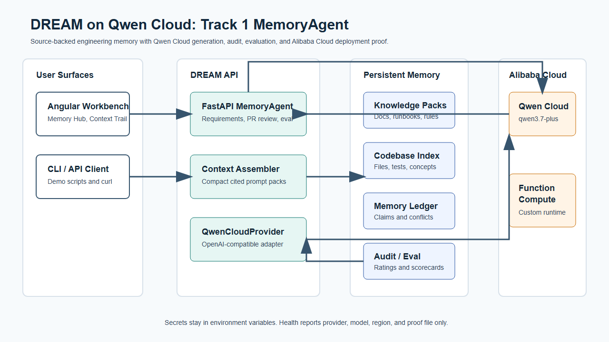

<!-- SPDX-License-Identifier: Apache-2.0 -->

# Building DREAM: A Qwen Cloud MemoryAgent That Knows When to Forget

Most AI assistants have two uncomfortable modes: they either forget everything
between sessions, or they remember too much without knowing which truth is
current.

Imagine that an engineer tells an agent, “Use a 10% canary for 30 minutes.” A
week later, the engineer changes the rule to “Use a 20% canary for 45 minutes.”
A naive memory system may retrieve both. A stateless assistant retrieves
neither. In a deployment review, either failure can produce a confident but
wrong recommendation.

For the Global AI Hackathon Series with Qwen Cloud, I built **DREAM** as a
Track 1 MemoryAgent around a stricter idea:

> An agent should not merely remember more. It should maintain one current,
> auditable truth, forget obsolete guidance on time, and recall only what fits
> the decision budget.

The result combines Qwen Cloud's semantic judgment with deterministic lifecycle
governance, source provenance, constrained retrieval, feedback, and
cryptographic request receipts. It runs publicly on Alibaba Cloud Function
Compute.

[Watch the 124-second demo](https://youtu.be/vh9k99YWXcQ) or
[run the live Judge Arena](https://dream-a-runtime-mdvperjjet.ap-southeast-1.fcapp.run/hackathon-demo).



## The Design Boundary That Made the System Work

The hardest architectural decision was deciding what the model should control.

Qwen is good at interpreting language. It can determine whether an observation
is a durable preference, an operating policy, a reusable lesson, a conflict,
an explicit forget request, or noise. But a model response alone should not be
the database transaction that changes organizational truth.

DREAM therefore separates **semantic proposal** from **governed action**:

1. Qwen receives the observation and relevant active memories.
2. Qwen returns a structured proposal: `remember`, `supersede`, `forget`, or
   `ignore`, plus memory kind, key, value, confidence, and rationale.
3. DREAM validates the proposal against deterministic invariants.
4. DREAM applies the lifecycle transaction, or safely falls back when the
   proposal is malformed or inconsistent.
5. Recall filters inactive and expired values before ranking current memory
   into a hard token budget.

This boundary means Qwen supplies the understanding while DREAM supplies the
state machine. The system can benefit from model intelligence without asking a
probabilistic component to enforce uniqueness, expiry, or deletion guarantees.

## Three Sessions, One Current Truth

The public Judge Arena runs a fresh three-session proof:

- **Session 1:** Qwen recognizes the 10% canary instruction as durable and
  proposes `remember`.
- **Session 2:** Qwen sees the new 20% instruction and proposes `supersede`.
  DREAM retires the earlier value and keeps one active truth.
- **Session 3:** With no chat history and a 64-token context budget, DREAM
  recalls only the current 20% canary for 45 minutes. The obsolete 10% value is
  explicitly checked for leakage.

The UI deliberately shows “Qwen proposal” and “DREAM action” separately. It
also shows the active/superseded ledger, budget use, selected memory, and
feedback controls. This makes the critical logic visible instead of hiding it
behind a chat bubble.

## Proving the Calls Really Reached Qwen Cloud

A polished demo can be faked accidentally by cached or seeded data, so every
live curator decision can emit a safe receipt containing:

- provider and model identity
- provider request ID and response ID when available
- endpoint host
- request and response SHA-256 hashes
- request/completion timestamps and latency

The receipt never stores the API key or raw prompt. It proves that a particular
request and response crossed the Qwen Cloud boundary while keeping sensitive
content out of public evidence.

The published lifecycle benchmark contains **37 receipts for 37 Qwen curator
decisions**. Three repeated full runs produced **111 receipts for 111
decisions**, with all 24 cases passing in every run.

## Did Memory Actually Improve Decisions?

Lifecycle correctness is necessary, but Track 1 also asks whether decisions
become more accurate over time. I did not want to answer that with an anecdote,
so I built a paired same-model benchmark.

Both arms used `qwen3.7-plus`, temperature `0`, the same seven engineering
requests, the same output contract, and the same deterministic scorer. The
changed variable was the evidence available to Qwen:

- **Stateless Qwen:** no organizational evidence.
- **Qwen + DREAM:** evidence retrieved from DREAM's governed memory.

| Metric | Stateless Qwen | Qwen + DREAM | Delta |
|---|---:|---:|---:|
| Deterministic reference score | 25.3 | 48.7 | **+23.4** |
| Domain/risk recall | 18.8% | 43.8% | **+25.0 pp** |
| Expected source recall | 0.0% | 40.2% | **+40.2 pp** |
| Valid references | 0 | 105 | **+105** |
| Unsupported references | 0 | 0 | 0 |

DREAM scored higher in **7/7 paired cases**. The exact paired permutation test
gave **p=0.0156**.

This is a seven-case synthetic engineering benchmark, not a claim of production
effectiveness. One deterministic completion per arm does not estimate sampling
variance, and exact-term scoring misses semantic equivalence. Exact retrieval
Recall@12 was 35.6%, which remains a measured bottleneck. Publishing those
limitations matters: a benchmark should expose the next engineering problem,
not only produce a winning number.

## Testing Timely Forgetting and Limited Context

A second benchmark focuses on memory lifecycle behavior across 24 scenarios:

- durable preference carryover
- policy and preference conflicts
- TTL expiry
- explicit forgetting
- duplicate rejection
- critical recall under small token budgets
- exclusion of superseded, expired, and forgotten values

The real Qwen run produced:

| Lifecycle metric | Result |
|---|---:|
| Cases passed | **24/24** |
| Qwen proposal accuracy | **100%** |
| Governed action accuracy | **100%** |
| Critical-memory recall | **100%** |
| Forbidden-memory leak | **0%** |
| Token-budget compliance | **100%** |
| Qwen receipt coverage | **37/37** |

The key lesson was that retrieval quality and lifecycle safety are different
questions. A system can retrieve relevant items and still leak an obsolete
truth. DREAM evaluates both.

## From Personal Experience to Organizational Memory

User preferences are only one memory layer. Engineering decisions also depend
on architecture docs, code, incidents, runbooks, tickets, pull requests, and
review rules.

DREAM distills those sources into claims with source spans, hashes,
classification, confidence, reviewer identity, and approval state. Conflicting
or unreviewed claims are blocked before retrieval. Approved claims can then
enter a Requirement Case, impact map, engineering brief, Jira draft, or PR
review summary while their provenance stays attached.

This is why DREAM is not designed as a generic chatbot. Its primary interface
is a set of reviewable engineering workflows and evidence trails.

## Deploying on Alibaba Cloud Function Compute

The deployment journey changed the design in useful ways.

I first explored Alibaba Container Registry, but the available console path was
Enterprise Edition. To keep the public demo reproducible and avoid unnecessary
infrastructure, I switched to an **ACR-free Function Compute code package**:

- Python 3.12 dependencies are built for Linux `manylinux2014_x86_64`.
- Angular production assets are included in the same package.
- A custom Debian runtime starts FastAPI through a small `bootstrap` script.
- Serverless Devs uploads the code directly to Function Compute.
- `/health` and `/qwencloud/showcase` expose non-secret runtime evidence.

The dedicated Model Studio workspace endpoint timed out from the Function
Compute runtime, while Alibaba's official shared Singapore endpoint worked with
the same workspace key. The deployed configuration therefore uses the shared
Singapore endpoint and keeps the dedicated workspace URL private.

The public runtime reports `qwen-cloud`, `qwen3.7-plus`, `ap-southeast-1`, the
Function Compute service, and the checked-in deployment proof path without
exposing credentials.

## Reproducing the Evidence

The repository is Apache-2.0 licensed. The most useful entry points are:

```powershell
# Lifecycle benchmark with a locally configured Qwen key
python scripts/qwencloud_experience_memory_benchmark.py `
  --cases examples/experience-benchmark/scenarios.yaml `
  --policy qwen-cloud `
  --env-file .env.qwencloud.local

# Same-model paired grounding benchmark
python scripts/qwencloud_memory_ab_benchmark.py `
  --output-dir artifacts/qwencloud-benchmarks

# Local proof and tests
scripts/qwencloud-run-local-proof.ps1
python -m pytest -q
```

Public evidence:

- [Source repository](https://github.com/zemeng2015/dream-ai-engineering-copilot/tree/codex/champion-memory-loop)
- [Live Judge Arena](https://dream-a-runtime-mdvperjjet.ap-southeast-1.fcapp.run/hackathon-demo)
- [Runtime health proof](https://dream-a-runtime-mdvperjjet.ap-southeast-1.fcapp.run/health)
- [Machine-readable showcase](https://dream-a-runtime-mdvperjjet.ap-southeast-1.fcapp.run/qwencloud/showcase)
- [A/B benchmark methodology](https://github.com/zemeng2015/dream-ai-engineering-copilot/blob/codex/champion-memory-loop/docs/qwen-memory-ab-benchmark.md)
- [Lifecycle benchmark methodology](https://github.com/zemeng2015/dream-ai-engineering-copilot/blob/codex/champion-memory-loop/docs/qwen-experience-memory-benchmark.md)
- [Alibaba deployment template](https://github.com/zemeng2015/dream-ai-engineering-copilot/blob/codex/champion-memory-loop/deploy/alibaba/serverless-devs-runtime.yaml)
- [Devpost submission](https://devpost.com/software/dream-qwen-cloud-memoryagent)

## What I Would Build Next

The next step is not “store more memories.” It is to improve retrieval quality
without weakening governance: human-reviewed production scenarios, encrypted
multi-tenant storage, semantic retrieval with exact provenance, and longer-term
online evaluation of whether feedback improves decisions.

The broader lesson is simple: useful agent memory is not a transcript database.
It is a governed learning loop. Qwen supplies semantic judgment; deterministic
software keeps time, truth, and accountability.

---

Built for the **Global AI Hackathon Series with Qwen Cloud**, Track 1:
MemoryAgent.
